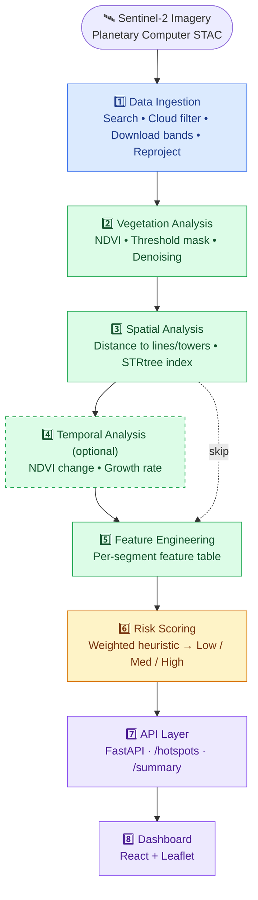
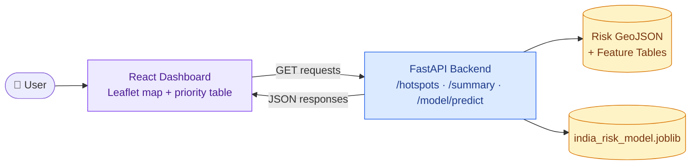

<div align="center">

# 🌿⚡ SIH1379 — Transmission Corridor Vegetation Risk Intelligence

**AI-powered vegetation risk detection for power line corridors, built on Sentinel-2 imagery**

[](#-known-limitations)
[](#prerequisites)
[](#prerequisites)
[](#-license)
[](#)


Ingests Sentinel-2 imagery + transmission infrastructure geometry → computes vegetation risk near power line corridors → serves it via **API + interactive dashboard**.

| 🧩 **8** | 🗺️ **379** | 🏷️ **1,659** | 🔬 **10 m** |
|:---:|:---:|:---:|:---:|
| Pipeline Stages | Transmission Lines (India, 220 kV+) | Labeled Observations | Sentinel-2 Resolution |

**🔗 Jump to:** [🚀 Quick Start](#-quick-start) · [🇮🇳 India Demo](#-india-data-prototype-deployment-ready-demo) · [🔌 API](#-api-endpoints) · [⚠️ Limitations](#-known-limitations) · [🗂 Data Sources](#-data-sources)

</div>

---

> [!WARNING]
> **Hackathon-grade prototype — not production-ready.** See [Known Limitations](#-known-limitations) for the documented gaps — resolution, ground truth, and auth — before relying on this for real operational decisions.

---

## 📑 Table of Contents

- [Architecture Overview](#-architecture-overview)
- [Quick Start](#-quick-start)
- [India Data Prototype](#-india-data-prototype-deployment-ready-demo)
- [India-Wide NDVI & Corridor ML Scoring](#-india-wide-ndvi-and-corridor-ml-scoring)
- [Detailed Setup Guide (Windows)](#-detailed-setup-and-run-guide)
- [Project Structure](#-project-structure)
- [Known Limitations](#-known-limitations)
- [Configuration](#-configuration)
- [API Endpoints](#-api-endpoints)
- [Future Work](#-future-work-v2)
- [Data Sources](#-data-sources)
- [License](#-license)

---

## 🏗 Architecture Overview

A single pipeline flows from raw satellite imagery to a scored, explainable dashboard in eight stages:

| Stage | Name | What Happens |
|:---:|---|---|
| 1️⃣ | **Data Ingestion** | Search Sentinel-2 L2A by AOI + date range · scene-level cloud filtering · download B2/B3/B4/B8/SCL bands · clip & reproject to EPSG:4326 |
| 2️⃣ | **Vegetation Analysis** | Compute NDVI `(B8−B4)/(B8+B4)` · threshold mask (default `0.3`) · morphological denoising · U-Net stub reserved for v2 |
| 3️⃣ | **Spatial Analysis** | Load transmission lines & towers · distance to nearest line segment / corridor edge · tower proximity · STRtree spatial index for speed |
| 4️⃣ | **Temporal Analysis** *(optional)* | NDVI change between two dates · linear growth rate (% change / day) · seasonal trends reserved for v2 |
| 5️⃣ | **Feature Engineering** | Per-corridor-segment feature table · vegetation fraction & mean NDVI · spatial + temporal features → CSV + GeoPackage |
| 6️⃣ | **Risk Scoring** *(heuristic v1)* | Weighted sum of proximity, density, growth & condition · normalized 0–1 · bucketed Low / Medium / High · explainable breakdown |
| 7️⃣ | **API Layer** *(FastAPI)* | `/hotspots` → GeoJSON · `/hotspots/{id}` → full detail · `/ndvi-layer` → tiles · no auth (demo) |
| 8️⃣ | **Dashboard** *(React + Leaflet)* | Color-coded risk map · side panel with score breakdown & NDVI · sortable top-priorities table |

Visually, the pipeline flows like this — solid arrows always run, the dashed edge is the shortcut taken when temporal analysis is skipped:



*Blue = ingestion · Green = analysis (dashed = optional) · Amber = scoring · Purple = serving*

---

## 🚀 Quick Start

### Prerequisites

| Requirement | Version | Notes |
|---|---|---|
| Python | 3.10+ | Core pipeline & API |
| Node.js | 18+ | Dashboard build |
| Planetary Computer access | — | Free, no auth needed for STAC search |

### Installation

```bash
# Python dependencies
pip install -r requirements.txt

# Dashboard dependencies
cd dashboard && npm install && cd ..
```

### Run the Pipeline

```bash
# Full pipeline (ingestion → risk scoring)
python src/pipeline.py \
  --aoi data/sample_aoi.geojson \
  --start-date 2024-01-01 \
  --end-date 2024-01-31 \
  --output-dir ./data/output \
  --transmission-lines data/sample_transmission_lines.geojson \
  --tower-locations data/sample_towers.geojson
```

<details>
<summary>Run with temporal analysis (needs multi-date imagery)</summary>

```bash
python src/pipeline.py \
  --aoi data/sample_aoi.geojson \
  --start-date 2024-01-01 \
  --end-date 2024-02-28 \
  --output-dir ./data/output \
  --transmission-lines data/sample_transmission_lines.geojson \
  --run-temporal \
  --days-between 30
```

</details>

### Run the API Server

```bash
# After the pipeline completes, results are copied to ./data/
uvicorn src.api.main:app --host 0.0.0.0 --port 8000 --reload
```

### Run the Dashboard

```bash
cd dashboard && npm start
# → http://localhost:3000
```

---

## 🇮🇳 India Data Prototype (deployment-ready demo)

The checked-in `data/` directory ships with a ready-to-use India dataset:

| File | Contents |
|---|---|
| `GatiShakti_Transmission_Lines_220kV_plus.geojson` | 379 Indian 220 kV+ transmission-line features |
| `SIH1379_ML_Training_Dataset.csv` | 1,659 labelled Indian observations used for API + ML training |

**1. Train the India-specific inspection-priority classifier:**

```bash
python src/ml/train_india_model.py \
  --dataset data/SIH1379_ML_Training_Dataset.csv \
  --output-dir data/models
```

This produces:
- `data/models/india_risk_model.joblib`
- `data/models/india_risk_model_metrics.json` (held-out evaluation report)

**2. Start the API and build the dashboard for deployment:**

```bash
python -m uvicorn src.api.main:app --host 0.0.0.0 --port 8000
cd dashboard && npm run build
```

Deploy `dashboard/build` as a static site and point its API proxy/base URL at the deployed FastAPI instance. The API exposes `/hotspots`, `/summary`, `/model/status`, and `/model/predict`.

> [!WARNING]
> **Model caveat:** trained on the supplied SIH1379 labels, whose rare high-risk class has only **five** examples. Suitable for prototype inspection prioritization — **not** autonomous operational decisions.

---

## 🛰 India-Wide NDVI and Corridor ML Scoring

India-wide Sentinel-2 imagery is acquired **on demand** (not bundled — coverage is large). The resumable grid downloader tracks progress in `india_ndvi_manifest.json`:

```bash
python src/ingestion/india_ndvi_ingest.py \
  --start-date 2025-01-01 --end-date 2025-01-31 \
  --output-dir data/india_ndvi --cell-size-degrees 2.5
```

Then run vegetation analysis on each downloaded B04/B08 pair and score the line corridors:

```bash
python src/ml/corridor_risk_model.py \
  --transmission-lines data/GatiShakti_Transmission_Lines_220kV_plus.geojson \
  --ndvi-raster data/india_ndvi/ndvi/india_latest_ndvi.tif \
  --model data/models/india_risk_model.joblib \
  --output data/india_corridor_risk.geojson
```

Results are served at **`GET /india-corridor-risk`**.

> [!NOTE]
> This is **segment-level inspection prioritization** — it does not identify individual trees or prove conductor contact. Sentinel-2 NDVI is a vegetation proxy, and the classifier is trained on weak inspection labels rather than outage ground truth.

---

## 🪟 Detailed Setup and Run Guide

<details>
<summary><b>Full Windows / PowerShell walkthrough — click to expand</b></summary>

Run all commands from the repository root (`SIH`). Keep the API and dashboard running in separate terminal windows.

### 1. Check required software

- Python 3.10+
- Node.js 18+ and npm
- Git (if cloning)
- Internet access for Sentinel-2 / WorldCover STAC downloads and map tiles

```powershell
python --version
node --version
npm --version
```

### 2. Create and activate the Python environment

```powershell
python -m venv .venv
Set-ExecutionPolicy -Scope Process -ExecutionPolicy RemoteSigned
.\.venv\Scripts\Activate.ps1
python -m pip install --upgrade pip
python -m pip install -r requirements.txt
```

> [!IMPORTANT]
> The geospatial packages (`geopandas`, `rasterio`, `fiona`, `pyproj`, `shapely`) must install successfully — the API, spatial analysis, and NDVI workflow all depend on them. If wheels aren't available for your Python version, switch to 3.11/3.12 and recreate `.venv` rather than mixing interpreters.

### 3. Install dashboard dependencies

```powershell
Push-Location dashboard
npm install
Pop-Location
```

The dashboard (React + Leaflet) reads live API data when available and falls back to static files in `dashboard/public/data/` otherwise.

### 4. Train the included India model

```powershell
python src/ml/train_india_model.py `
  --dataset data/SIH1379_ML_Training_Dataset.csv `
  --output-dir data/models
```

**Expected outputs:** `data/models/india_risk_model.joblib`, `data/models/india_risk_model_metrics.json`

> [!IMPORTANT]
> This classifier predicts an inspection-priority label from distance, NDVI, and vegetation factors. It is **not** an outage predictor and should not drive automatic switching or maintenance decisions.

### 5. Start the FastAPI backend

```powershell
python -m uvicorn src.api.main:app --host 127.0.0.1 --port 8000 --reload
```

| Check | URL |
|---|---|
| API info | `http://127.0.0.1:8000/` |
| Swagger UI | `http://127.0.0.1:8000/docs` |
| Transmission lines | `http://127.0.0.1:8000/transmission-lines` |
| Risk summary | `http://127.0.0.1:8000/summary` |
| Model status | `http://127.0.0.1:8000/model/status` |

> [!NOTE]
> Start this from the repository root — data paths are relative to `./data`.

### 6. Start the dashboard

```powershell
Push-Location dashboard
npm start
```

Open `http://localhost:3000`. The dashboard proxy forwards API requests to `http://localhost:8000` (see `dashboard/package.json`).

**If `npm start` fails with a webpack-dev-server `allowedHosts` error**, build and serve the static bundle instead:

```powershell
Push-Location dashboard
npm run build
Pop-Location
python -m http.server 3000 --directory dashboard/build
```

Then open `http://127.0.0.1:3000` (note: no dev proxy in static mode — configure the API URL for your deployment if you need live data).

### 7. Run the sample end-to-end pipeline

```powershell
python src/pipeline.py `
  --aoi data/sample_aoi.geojson `
  --start-date 2024-01-01 `
  --end-date 2024-01-31 `
  --output-dir data/output `
  --transmission-lines data/sample_transmission_lines.geojson `
  --tower-locations data/sample_towers.geojson
```

Results land under `data/output/`; the final risk JSON and summary are copied to `data/` for API consumption. Check `data/output/logs/` if a stage fails — optional data sources may fail while core stages continue.

### 8. Acquire India-wide NDVI on demand

```powershell
python src/ingestion/india_ndvi_ingest.py `
  --start-date 2025-01-01 `
  --end-date 2025-01-31 `
  --output-dir data/india_ndvi `
  --cell-size-degrees 2.5 `
  --cloud-cover-max 20
```

Searches Copernicus Sentinel-2 L2A scenes and stores bands under `data/india_ndvi/cells/`. Progress is tracked in `data/india_ndvi/india_ndvi_manifest.json` so completed cells are skipped on re-runs. This can be storage/bandwidth/time intensive — start with a larger cell size or smaller date range.

Then compute NDVI from matching B04/B08 bands:

```powershell
python src/analysis/vegetation_analysis.py `
  --tile-id <tile-id> `
  --bands-dir data/india_ndvi/cells/<cell-id>/geotiffs `
  --output-dir data/india_ndvi/vegetation `
  --ndvi-threshold 0.3
```

Repeat per downloaded tile, or automate after confirming manifest/tile naming for your date range.

### 9. Score vegetation risk along the India line layer

```powershell
python src/ml/corridor_risk_model.py `
  --transmission-lines data/GatiShakti_Transmission_Lines_220kV_plus.geojson `
  --ndvi-raster <path-to-ndvi-geotiff> `
  --model data/models/india_risk_model.joblib `
  --output data/india_corridor_risk.geojson `
  --corridor-buffer-m 50 `
  --segment-length-m 500 `
  --ndvi-threshold 0.3
```

Output: GeoJSON line segments with mean NDVI, vegetation fraction, sampled-pixel count, risk score, and Low/Medium/High category — served at `http://127.0.0.1:8000/india-corridor-risk` once the file exists.

### 10. Run tests and basic checks

```powershell
python -m pytest -q
python -m py_compile src/api/main.py src/pipeline.py
```

Build the frontend before deployment:

```powershell
Push-Location dashboard
npm run build
Pop-Location
```

</details>

### 🛠 Troubleshooting

| Symptom | Fix |
|---|---|
| `ModuleNotFoundError` for `geopandas`, `rasterio`, etc. | Confirm the venv is active, then `pip install -r requirements.txt` from the same interpreter. If Fiona/GDAL won't build, recreate the venv on Python 3.11/3.12. |
| `npm start` says `package.json` cannot be found | Run it inside `dashboard/`, not the repo root. |
| Dashboard shows fallback/demo data | Start the API on port 8000, confirm `/hotspots` and `/transmission-lines` respond, then reload. With no generated risk file, the API falls back to checked-in training observations. |
| No Sentinel-2 scenes found | Expand the date range, raise `--cloud-cover-max`, verify AOI CRS, and check STAC connectivity. **Don't** treat missing imagery as zero vegetation. |

---

## 📁 Project Structure

```
SIH/
├── src/
│   ├── ingestion/          # Stage 1 — Sentinel-2 ingestion
│   │   └── sentinel2_ingest.py
│   ├── analysis/           # Stage 2 — NDVI + vegetation mask
│   │   └── vegetation_analysis.py
│   ├── spatial/            # Stage 3 — Distance features
│   │   └── spatial_analysis.py
│   ├── temporal/           # Stage 4 — NDVI change / growth
│   │   └── temporal_analysis.py
│   ├── features/           # Stage 5 — Feature table
│   │   └── feature_engineering.py
│   ├── risk/                # Stage 6 — Heuristic risk scorer
│   │   └── risk_scoring.py
│   ├── api/                 # Stage 7 — FastAPI endpoints
│   │   └── main.py
│   └── pipeline.py          # Master orchestrator
├── dashboard/                # Stage 8 — React + Leaflet
│   ├── src/
│   │   ├── App.js
│   │   ├── index.js
│   │   └── index.css
│   └── package.json
├── data/
│   ├── sample_aoi.geojson
│   ├── sample_transmission_lines.geojson
│   └── sample_towers.geojson
├── requirements.txt
└── README.md
```

---

## ⚠️ Known Limitations

Explicitly documented design constraints for v1 (hackathon prototype):

| # | Limitation | Detail |
|:---:|---|---|
| 1 | **10 m Resolution Limit** | Sentinel-2 is 10 m resolution — **cannot resolve individual trees near conductors**. Risk scores are corridor-segment-level, not tree-level. *(documented throughout pipeline code)* |
| 2 | **No Canopy Height Data** | NDVI / vegetation fraction is a **proxy** for risk, not a direct fall/contact measurement. *(stated in risk explanations shown to users)* |
| 3 | **No Historical Ground Truth** | Risk scoring is an **explicit weighted heuristic** (transparent, tunable weights) — not framed as trained supervised ML. Extension point exists for supervised training once labeled incident data is available. *(see `src/risk/risk_scoring.py`)* |
| 4 | **Land Cover Not Guaranteed** | When land cover data is unavailable, the system flags when NDVI-high areas might be cropland vs. woody vegetation — but can't fully distinguish crop types. |
| 5 | **Cloud Filtering (Scene-Level Only)** | Uses scene-level cloud cover metadata (<20% default); no per-pixel masking in v1. SCL band available but not fully utilized. |
| 6 | **Security: No Auth / RBAC** | API has **no authentication** for hackathon demo — flagged as a `TODO` in `src/api/main.py` for any real deployment given infrastructure data sensitivity. |

---

## ⚙️ Configuration

**Pipeline parameters** (`src/pipeline.py` or via CLI):

| Parameter | Default | Description |
|---|:---:|---|
| `--cloud-cover-max` | `20%` | Max scene cloud cover |
| `--ndvi-threshold` | `0.3` | NDVI threshold for vegetation |
| `--corridor-buffer-m` | `50m` | Corridor half-width |
| `--days-between` | `N/A` | Days between observations (temporal) |

**Risk weights** (`src/risk/risk_scoring.py`):

```python
WEIGHTS = {
    "proximity": 0.40,   # Distance to line
    "density": 0.25,     # Vegetation fraction
    "growth": 0.20,      # Growth rate
    "condition": 0.15,   # Vegetation health (NDVI)
}
THRESHOLDS = {"high": 0.7, "medium": 0.4}
```

---

## 🔌 API Endpoints

At runtime, the dashboard talks to the API over REST; the API reads from the generated risk files and the trained model:



*Purple = client · Blue = backend · Amber = stored artifacts*

| Method | Endpoint | Description |
|---|---|---|
| `GET` | `/` | API info |
| `GET` | `/hotspots` | GeoJSON FeatureCollection of risk segments |
| `GET` | `/hotspots/{id}` | Full detail with score breakdown |
| `GET` | `/summary` | Risk statistics |
| `GET` | `/ndvi-layer` | NDVI tile metadata |
| `GET` | `/india-corridor-risk` | India-wide corridor risk scoring |
| `GET` | `/model/status` | ML model status |
| `GET` | `/model/predict` | Inspection-priority prediction |

<details>
<summary>Example <code>/hotspots</code> response</summary>

```json
{
  "type": "FeatureCollection",
  "features": [
    {
      "type": "Feature",
      "id": 0,
      "properties": {
        "segment_id": 0,
        "risk_score": 0.82,
        "risk_category": "High",
        "vegetation_fraction": 0.45,
        "mean_dist_to_line_m": 12.3
      },
      "geometry": { "type": "LineString", "coordinates": ["..."] }
    }
  ],
  "metadata": { "generated_at": "...", "count": 42, "summary": {} }
}
```

</details>

---

## 🔮 Future Work (v2+)

**Perception & Modeling**
- [ ] **U-Net segmentation** for vegetation (replace threshold)
- [ ] **LiDAR canopy height** integration
- [ ] **Supervised risk model** with outage incident labels
- [ ] **LSTM/Transformer** for growth forecasting

**Data & Analysis**
- [ ] **Land cover classification** (ESA WorldCover / Dynamic World)
- [ ] **Rolling temporal stats** & seasonal trend modeling

**Platform & Ops**
- [ ] **Auth/RBAC** on API
- [ ] **PostGIS backend** for production-scale queries

---

## 🗂 Data Sources

| # | Dataset | Source | Purpose |
|:---:|---|---|---|
| 1 | **Sentinel-2 Surface Reflectance** (`COPERNICUS/S2_SR_HARMONIZED`) | ESA / Copernicus, via Google Earth Engine | Satellite vegetation monitoring & NDVI calculation |
| 2 | **GridFinder Power Grid Dataset** | GridFinder / World Bank research dataset | Initial power-grid & transmission-line spatial analysis; distance-to-line calculations |
| 3 | **PM GatiShakti 220 kV+ Transmission Lines** | Ministry of Power, Government of India | Mapping & validation of high-voltage transmission infrastructure — `data/GatiShakti_Transmission_Lines_220kV_plus.geojson`, `data/GatiShakti_220kV_Transmission_Shapefile.zip` |
| 4 | **Study Area** | Project-defined geometry | Kanpur region, Uttar Pradesh, India — geographic boundary for vegetation & corridor analysis |

---

## 📄 License

MIT License — Hackathon prototype for **SIH1379**.

<div align="center">

Built for Smart India Hackathon 2025 — Problem Statement **SIH1379**

</div>